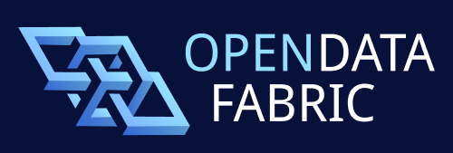

<div align="center">



<p>

[](https://www.npmjs.com/package/@opendatafabric/contracts)
[](https://github.com/kamu-data/kamu-contracts/actions)
[](https://discord.gg/nU6TXRQNXC)

</p>
</div>

## About

This repository contains smart contracts for interacting with the
[Open Data Fabric Network](https://docs.kamu.dev/odf/), such as Oracle API for querying off-chain
data from repositories like [Kamu Node](https://docs.kamu.dev/node/).

If you are new to Open Data Fabric and Kamu - please [start here](https://docs.kamu.dev/welcome/).

## Getting Started

### Preparation

For building contracts, we use [Foundry](https://github.com/foundry-rs/foundry). To install, please
use [the official documentation](https://book.getfoundry.sh/getting-started/installation).

https://book.getfoundry.sh/getting-started/installation

---

After that, we can start building the contacts:

```shell
npm run build
```

## Community

If you like what we're doing - support us by starring the repo, this helps us a lot!

Subscribe to our [YouTube channel](https://www.youtube.com/channel/UCWciDIWI_HsJ6Md_DdyJPIQ) to get
fresh tech talks and deep dives.

Stop by and say "hi" in our [Discord Server](https://discord.gg/nU6TXRQNXC) - we're always happy to
chat about data.

If you'd like to contribute [start here](https://docs.kamu.dev/contrib/).

---

<div align="center">
  
[Website] | [Docs] | [Tutorials] | [Examples] | [FAQ] | [Chat] | [Contributing] | [Developer Guide] | [License]

</div>

[Tutorials]: https://docs.kamu.dev/cli/learn/learning-materials/
[Examples]: https://docs.kamu.dev/cli/learn/examples/
[Docs]: https://docs.kamu.dev/cli/
[Documentation]: https://docs.kamu.dev/cli/
[Demo]: https://docs.kamu.dev/cli/get-started/self-serve-demo/
[FAQ]: https://docs.kamu.dev/cli/get-started/faq/
[Chat]: https://discord.gg/nU6TXRQNXC
[Contributing]: https://docs.kamu.dev/contrib/
[Developer Guide]: ./DEVELOPER.md
[License]: https://docs.kamu.dev/contrib/license/
[Website]: https://kamu.dev
